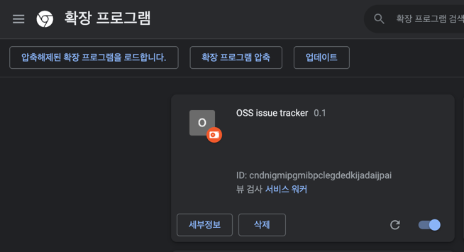

<!-- ABOUT THE PROJECT -->

# Github-Issue-Tracker

Github 이슈를 편하게 이용할 수 있게 도와주는 크롬 플러그인입니다.

크롬 익스텐션 특성상 어느 페이지에서든 접근 가능하기 때문에 사용성이 좋고 빠릅니다.

<!-- USAGE EXAMPLES -->

---

# Usage

## 이슈 하이라이팅


이슈 메인 화면에서 읽었던 이슈, pin 설정한 이슈를 표기해줍니다.

- default 100개까지 저장되게 설정되어 있습니다.
- pull requests 페이지에도 동일하게 동작됩니다.

## 최근 이슈 모달


최근 열었던 이슈들을 시간 내림차순으로 정렬해서 리스팅해줍니다. 이슈를 클릭하면 해당 이슈 페이지로 이동합니다.

- Window : `Ctrl` + `Shift` + `I`
- Mac : `Cmd` + `Shift` + `I`
- 검색 기능 제공 (모달을 열었을 시에 자동으로 검색바로 포커싱 됩니다.)
- organization, repo, pinned 세 가지로 필터링이 가능합니다.

## 최근 PR 모달


최근 이슈 모달과 동일한 기능을 제공하는 PR용 모달입니다.

- Window : `Ctrl` + `Shift` + `P`
- Mac : `Cmd` + `Shift` + `P`

## 이슈 Pin 하기


pin 기능을 제공합니다.

- '최근이슈모달' 로 pin 가능
- 이슈 페이지에서 핀된 이슈 표기됨
- 모달에서 pin 된 이슈들만 필터링해서 확인 가능

## 기타 필터링 기능


## 최근 이슈로 이동

가장 마지막으로 로드했던 이슈로 이동한다.

- Window : `Ctrl` + `Shift` + `1`
- Mac : `Cmd` + `Shift` + `1`

가장 마지막으로 로드했던 PR로 이동한다.

- Window : `Ctrl` + `Shift` + `2`
- Mac : `Cmd` + `Shift` + `2`

## 옵션값 설정

(v0.3 에 추가됨)


- 브라우저 우측 상단에 Github issue tracker 아이콘 우클릭 -> `옵션` 으로 접근 가능


- `URL`: tracking 할 깃허브 혹은 enterprise 깃허브의 url
    - default: `github.com/`
    - 현재 이슈가 있어서 막아둠 (default값인 `github.com/` 만 사용가능)
- `Maximum number of issues`: 최근 목록으로 저장할 이슈 최대 갯수
    - default: 100
    - 1 <= maxIssuesCount <= 1000
- `Maximum number of Prs`: 최근 목록으로 저장할 PR의 최대 갯수
    - default: 100
    - 1 <= maxIssuesCount <= 1000
- `Text-color of read-issue-title`: 읽은 이슈의 타이틀 글자색
    - default: `#55D8C1`
- `Text-color of pinned-issue-title`: 핀 된 이슈의 타이틀 글자색
    - default: `#FF6FB5`

<!-- GETTING STARTED -->

--- 

# 시작하기

## private 플러그인 링크를 통해 설치

- 업로드중

## 소스코드를 이용해 직접 설치

### 사전 준비사항

#### 1. node js 및 yarn 설치

타입스크립트 기반의 svelete 패키지로 구성이 되어있기 때문에 빌드 시에 node js 와 yarn이 설치되어있어야 합니다.

- [node 설치](https://nodejs.org/ko/download/)
- [yarn 설치](https://heropy.blog/2017/11/25/yarn/)

#### 2. 크롬 브라우저 설치

- [크롬 브라우저 최신 버전](https://www.google.com/intl/ko_kr/chrome/) (반드시 최신일 필요는 없습니다.)

> 크롬 브라우저에서만 지원되는 소스입니다. 파이어 폭스 등 다른 브라우저 지원은 아직 구현 못했습니다.. 혹시나 PR 날려주시면 감사하겠습니다 😘 )

#### Github 테마 설정 (Optional)

`Settings` > `Appearances` 에서 Theme mode 를 `Dark dimmed` 로 설정하고 사용하시는 것을 권장합니다.

다른 테마도 사용하는데에는 상관없지만, 제가 `Dark dimmed` 테마를 바탕으로 작업해서, 다른 테마에 어떻게 보여질지 테스트를 해보지 못했네요 🥲

### 설치


1. 사전 준비사항을 완료합니다.
2. [release]() 된 소스코드를 다운로드합니다. 혹은 추후에 기여할 생각이
   있으시다면, [Github-Issue-Tracker 레포](https://github.com/SeoSang/github-issue-tracker) 를 클론하셔도 됩니다.
4. 패키지에 들어가서, 필요한 모듈들을 설치 및 빌드합니다.
   ```sh
   $ cd src
   $ yarn
   $ yarn build
   ```
5. 빌드가 잘 완료되었다면, `/public/dist` 아래에 아래 5가지 파일은 반드시 생성되어있어야 합니다. 그렇지 않다면 `rollup.config.js` 를 수정해서 해결해주세요.
    - `background.js`
    - `main.js`
    - `popup.js`
    - `options.js`
    - `bundle.css`
6. 크롬 브라우저로 `chrome://extensions/` 에 접속합니다.
   
7. `압축해제된 확장 프로그램을 로드합니다.` 를 클릭해 빌드가 완료된 패키지를 지정해줍니다.
   <br/>
   
   아래처럼 디렉토리 전체를 지정해줍니다.
   <br/>
   
8. 아래와 같이 플러그인이 정상적으로 로드됐다면 성공입니다.
   
   (`오류` 가 뜰 수 있는데, 특별한 경우가 아닌 이상 실제 기능에는 문제 없을 것입니다.)

---

# 주의 ⚠️

짧은 시간동안 버닝해서 만든 익스텐션이라 다양한 버그가 존재할 수 있습니다.. 버그를 발견한다면 제보 바랍니다! (혹은 PR 올려주시면 200배 감사 🙏🏼)

- 깃허브에서 공식적인 업데이트가 생길 때마다 기능이 정상 작동하지 않을 수도 있음.
- 모달이 로드된 화면마다 css가 달라짐.
- 모달 반응형으로 구현되어있지 않음.
- 모바일 지원 x
- 동일 계정 다른 기기 간에 sync는 지원하지 않음. (sync 가능하게 할 수 있는데, 그러면 저장 가능한 용량이 급격히 줄어들기 때문..)

# 사용한 기술 스택

- 기본적인 코드 작성 : TypeScript를 기반으로한 [Svelte](https://svelte.dev/docs)
- 빌드 : [rollup-js](https://rollupjs.org/guide/en/)
- 크롬 제공 API ([chrome extension doc](https://developer.chrome.com/docs/extensions/))

기타 참고

- 익스텐션 예시: [better-pull-request](https://github.com/berzniz/github_pr_tree)

---

# 기여(Contributing)

PR은 언제든 환영입니다. 브랜치 따서 올려주세요! (현재는 혼자 개발하다가 master 에 다 때려박음..)

1. Fork the Project (Collaborator 신청 한 경우 는 따로 fork 뜰 필요 없음)
2. Create your Feature Branch (`git checkout -b feature/AmazingFeature`)
3. Commit your Changes (`git commit -m 'Add some AmazingFeature'`)
4. Push to the Branch (`git push origin feature/AmazingFeature`)
5. Open a Pull Request

<!-- LICENSE -->

# License

Distributed under the MIT License.

<!-- CONTACT -->

# Contact

- [서상혁(SeoSang)](https://github.com/SeoSang)

---

감사합니다. Thank you!
